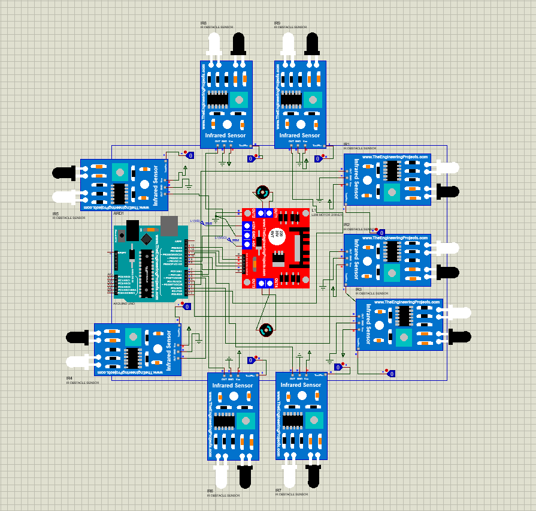

  # Robot Line Follower 9 Sensor Infrared

**Author:** Muhammad Reki (Semester 6)  
**Project:**Robotika  

## Deskripsi
Project ini adalah simulasi dan implementasi robot line follower menggunakan 9 sensor infrared. Robot mengikuti garis otomatis menggunakan Arduino dan sensor infrared.  

## Gambar Project
Simulasi dan tampilan robot:

## Folder Repository
- `sketch_mar12b/` : kode Arduino (.ino)  
- `Project Proteus/` : simulasi robot  
- `Project Backups/` : backup project  

## Cara Menggunakan
1. Buka file `.pdsprj` di Proteus  
2. Upload file `.ino` ke Arduino  
3. Robot siap mengikuti garis
